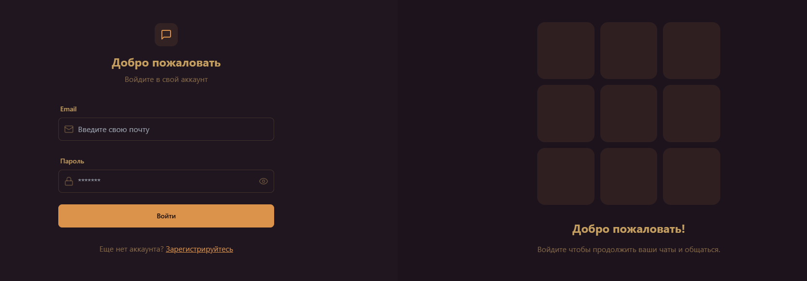

# Fullstack Chat App

## Описание проекта

Это приложение представляет собой полнофункциональный чат, разработанный с использованием современных технологий веб-разработки. Приложение позволяет пользователям общаться в режиме реального времени, обмениваться сообщениями и файлами. Оно создано с использованием стека технологий **MERN** (MongoDB, Express.js, React.js, Node.js).

## Основные функции

- Аутентификация пользователей через JWT-токены
- Реальное время обмена сообщениями
- Возможность отправки файлов
- Уведомления о новых сообщениях
- Личный кабинет пользователя с настройками профиля

## Технологии

- **Frontend**: React.js, Zustand, disiyui
- **Backend**: Node.js, Express.js
- **Database**: MongoDB
- **Authentication**: JSON Web Tokens (JWT)
- **Real-time communication**: Socket.IO
